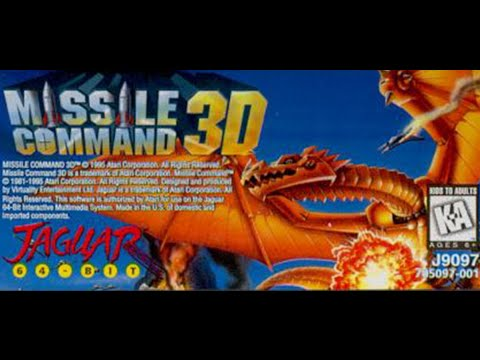

# Jaguar-headtracker

This project is envisioned to provide motion-tracking controller input for the Atari Jaguar console. It is forked from the project [open-headtracker](https://code.google.com/archive/p/open-headtracker/) which provided head tracking based control for radio controlled model aircraft. In this case, output shall be expanded to provide Jaguar-compatible signaling so motion can be used for Jaguar games.

Project website: [VR motion](http://www.jaguar64.eu/forum/viewtopic.php?f=49&p=40)

The initial test case shall be the ability to play the game Missile Command 3D.

[Gameplay video](https://www.youtube.com/watch?v=dOVprPw6GDs)

## Hardware

## Firmware

## Software

